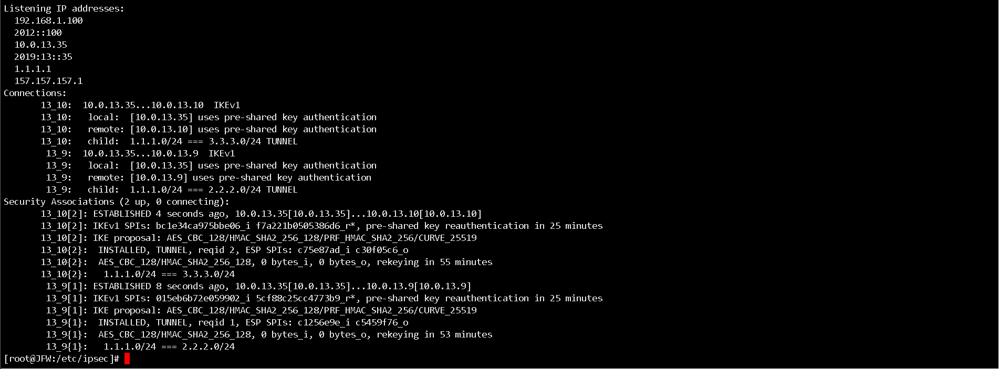

## Description of the problem of splitting tunnel configuration files in the /etc/ipsec/ directory

### My scenario is as follow:


Mainly look at the ipsec configuration of VPN1

Our general configuration is as follows：

```shell
# /etc/ipsec.conf - strongSwan IPsec configuration file
conn %default
    authby=secret
    keyexchange=ikev1
    ikelifetime=30m
    rekeymargin=3m
    keyingtries=1
conn 13_9
    left=10.0.13.35
    leftsubnet=1.1.1.0/24
    right=10.0.13.9
    rightsubnet=2.2.2.0/24
    auto=add
conn 13_10
    left=10.0.13.35
    leftsubnet=1.1.1.0/24
    right=10.0.13.10
    rightsubnet=3.3.3.0/24
    auto=add
    
# /etc/ipsec.secrets - strongSwan IPsec secrets file
10.0.13.8 10.0.13.9 : PSK "111"
10.0.13.8 10.0.13.10 : PSK "222"
```

Then I executed the command: ipsec restart


That's right, in this case, the VPN1-VPN2, VPN1-VPN3 tunnels are loaded

I have configured on VPN2 and VPN3 and it is linked, I use the command again on VPN1: ipsec statusall



This configuration is OK, and the communication is also OK

However, if I want to add another tunnel while VPN1 is running, without affecting other tunnels, I figured out a way. Now I reconfigure VPN1

```shell
# /etc/ipsec.conf - strongSwan IPsec configuration file
# I wrote the following in ipsec.conf to include all the .conf files in the /etc/ipsec/ directory
include /etc/ipsec/*.conf


# /etc/ipsec.secrets - strongSwan IPsec secrets file
# I wrote the following in ipsec.secrets to include all .secrets files in the /etc/ipsec/ directory
include /etc/ipsec/*.secrets
```


Then I add default.conf, 13_9.conf, 13_9.secrets files in the /etc/ipsec/ directory


Then I execute the commands: ipsec restart and ipsec statusall


OK, the tunnel of VPN1-VPN2 has been established and the communication is normal

Then I need to newly create 13_10.conf and 13_10.secrets files in the /etc/ipsec/ directory of VPN1 to configure the IPSec tunnel with VPN3


Let's execute a command on VPN1 before loading the 13_10 configuration file: ipsec statusall


Yes, the newly created tunnel configuration file is not loaded, now let's load this configuration file

I now want to load the VPN1-VPN3 tunnel, but I can't use the command: ipsec restart, this will cause the VPN1-VPN2 tunnel to disappear, I use the command: ipsec update

Oh shit, he actually succeeded


