### tunnel collision

My topology is as follows：

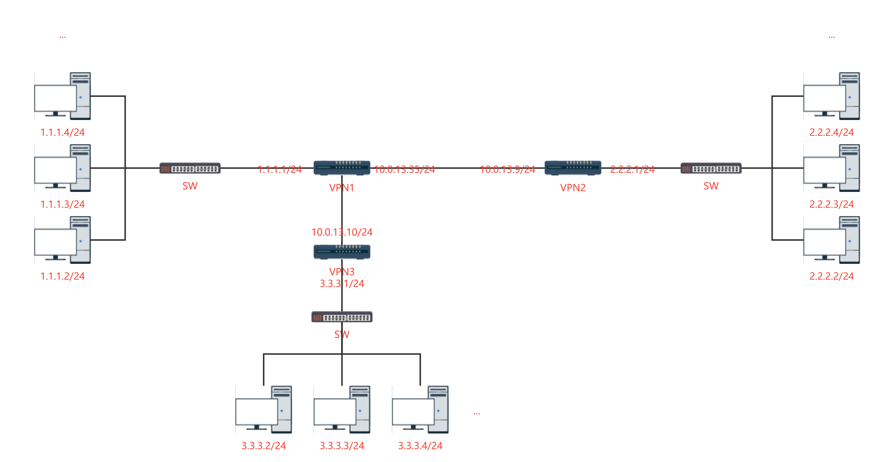

#### 10.0.13.35

The configuration file on 10.0.13.35 is as follows

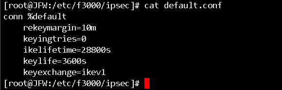

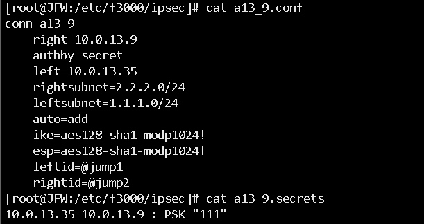

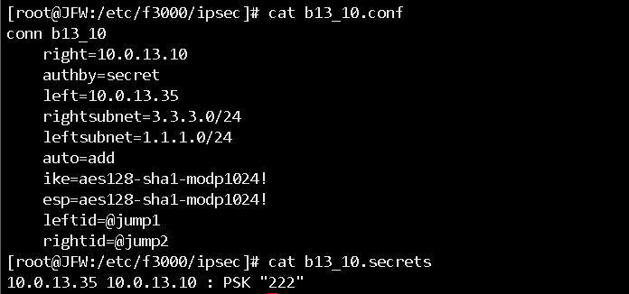

I did ipsec restart and ipsec statusall

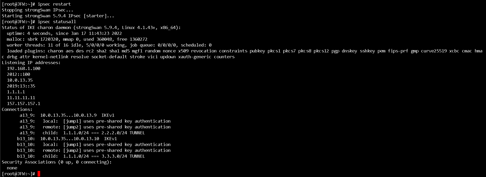

You can see that the leftid and rightid in the two tunnel configuration files are the same

#### 10.0.13.9:

Next I'll be working on linking on 10.0.13.9

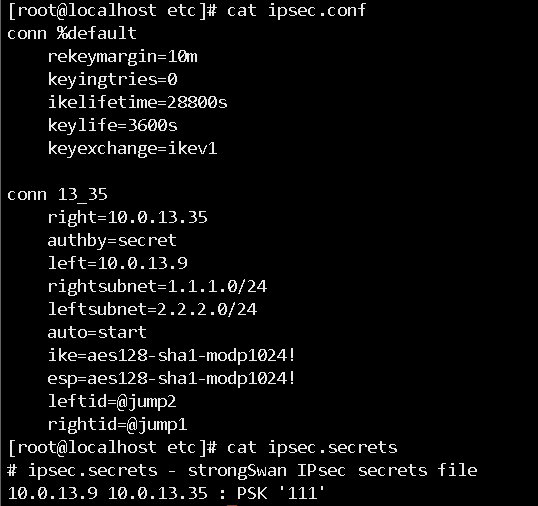

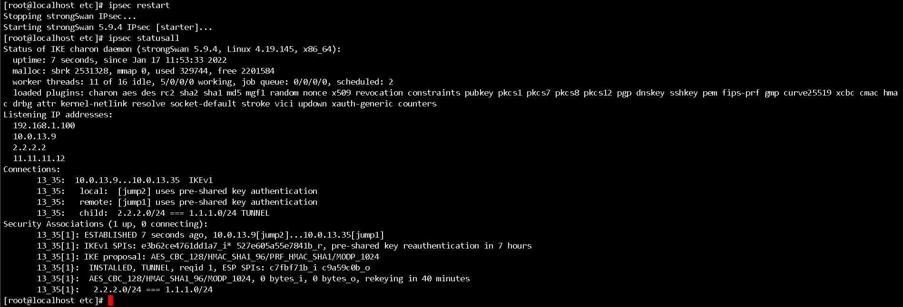

Yes, the link is successful

#### 10.0.13.35:

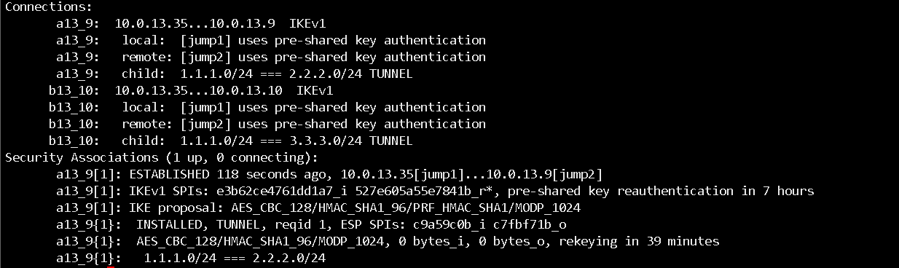

It can also be seen on 10.0.13.35, the tunnel is established successfully

#### 10.0.13.10:

Then I want to start the tunnel on 10.0.13.10 also to link with 10.0.13.35

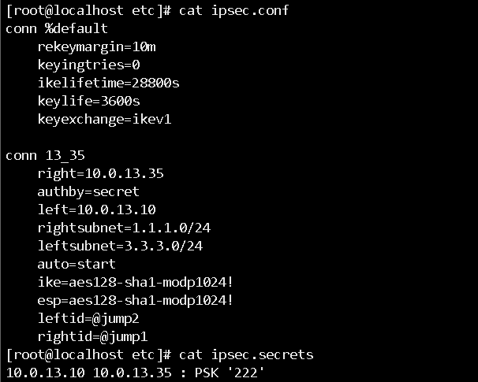

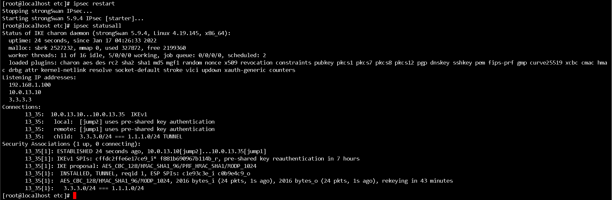

As you can see, the link is successful

But the tunnel with 10.0.13.9 is gone and terminated

#### 10.0.13.35:

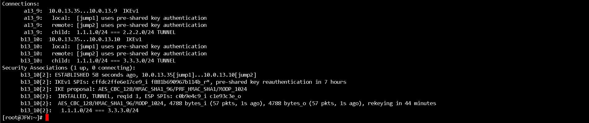

I did a packet grab on 10.0.13.9

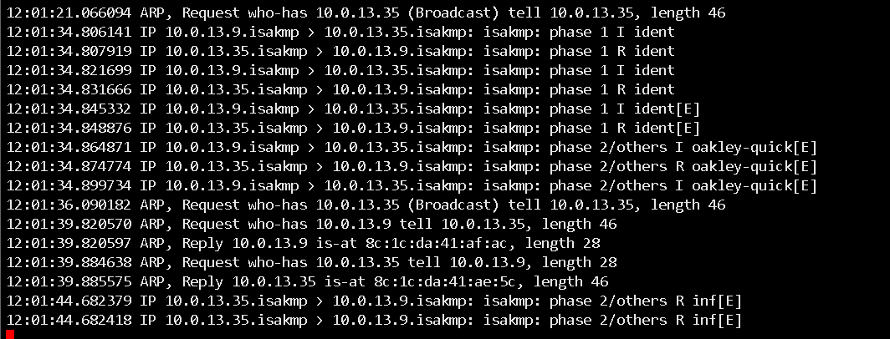

and I scraped the logs on 10.0.13.9

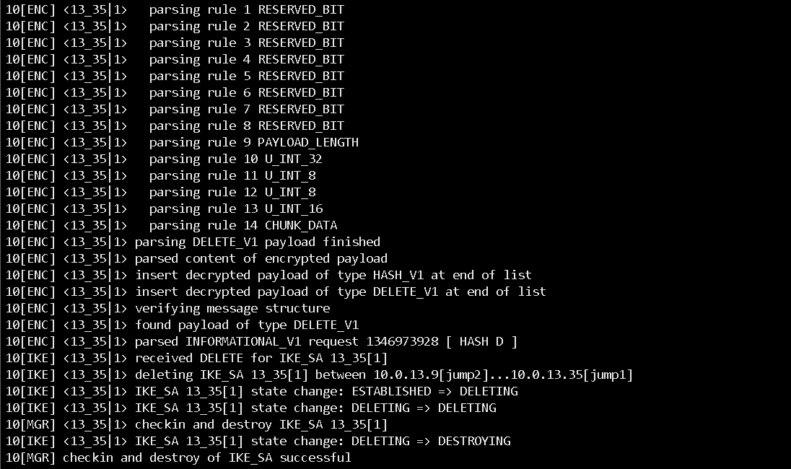

I don't know much about the underlying problem, I want to know how this is caused and how should I deal with it

This situation occurs mainly because the config setup option is not set

 Use different identities or disable `uniqueids` (see [ConfigSetupSection](https://wiki.strongswan.org/projects/strongswan/wiki/ConfigSetupSection)). 

